

<!-- BANNER - terminal profile.sh --live. Gerado por scripts/banner/generate.py
     e commitado pelo workflow Banner. ~0,8 MB cada. -->
<picture>
  <source media="(prefers-color-scheme: dark)"  srcset="assets/banner-dark.svg">
  <source media="(prefers-color-scheme: light)" srcset="assets/banner-light.svg">
  
</picture>

 

<!-- NOME / TAGLINE - digitacao animada -->

 

<!-- CONTATOS - LinkedIn fica no azul da marca (o glifo some em fundo custom). -->
&nbsp;&nbsp;
&nbsp;&nbsp;

 

---

## Prazer, Guilherme

Sou desenvolvedor **PHP / Laravel** e apaixonado por simplificar problemas complexos.
O que me move é transformar aquela solução que todo projeto refaz do zero em um pacote
que você instala com um `composer require` e esquece.

- 📦 **Pacotes publicados no [Packagist](https://packagist.org/packages/gsferro/)** — o card acima conta quantos e quantos downloads; a maioria carrega `easy` no nome, e isso não é enfeite: é o contrato.
- 🎛️ **Ecossistema Filament**: starter kit, stat cards, odometer. Painel administrativo pronto sem reescrever o mesmo widget em todo projeto.
- ⚡ **Laravel de ponta a ponta**: Eloquent, Livewire, Blade, filas, testes. Da migration até a view.
- 🧩 **Filosofia**: menos boilerplate, mais decisão tomada. Se você precisou escrever aquilo duas vezes, era para ser um pacote.
- 💬 Fale comigo sobre **arquitetura Laravel, Filament e design de pacotes** — assunto que me prende fácil.

## stack

---

## sinais

<table>
<tr>
<td width="50%" align="center" valign="middle">

<!-- Autoavaliacao - edite assets/skills.json e o workflow redesenha -->
<picture>
  <source media="(prefers-color-scheme: dark)"  srcset="assets/radar-dark.svg">
  <source media="(prefers-color-scheme: light)" srcset="assets/radar-light.svg">
  
</picture>

</td>
<td width="50%" align="center" valign="middle">

<!-- Linguagens reais, somando bytes dos repos publicos a cada execucao -->
<picture>
  <source media="(prefers-color-scheme: dark)"  srcset="assets/radar-langs-dark.svg">
  <source media="(prefers-color-scheme: light)" srcset="assets/radar-langs-light.svg">
  
</picture>

</td>
</tr>
</table>

---

## números

<!-- Gerados por scripts/cards.py e scripts/packagist.py dentro deste repo.
     De propósito NÃO são github-readme-stats / streak-stats / profile-trophy:
     aquelas são instâncias públicas compartilhadas que caem e levam a seção
     inteira junto. Estes arquivos vivem aqui e renderizam enquanto o GitHub
     renderizar. -->
<table>
<tr>
<td align="center" valign="top">

<picture>
  <source media="(prefers-color-scheme: dark)"  srcset="assets/card-stats-dark.svg">
  <source media="(prefers-color-scheme: light)" srcset="assets/card-stats-light.svg">
  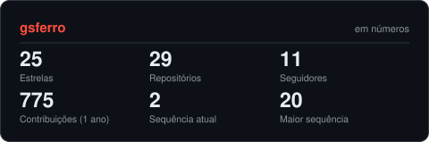
</picture>

</td>
<td align="center" valign="top">

<picture>
  <source media="(prefers-color-scheme: dark)"  srcset="assets/card-packagist-dark.svg">
  <source media="(prefers-color-scheme: light)" srcset="assets/card-packagist-light.svg">
  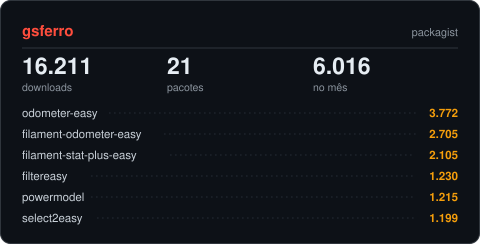
</picture>

</td>
</tr>
</table>

---

## pacotes em destaque

<table>
<tr>
<td align="center">
<a href="https://github.com/gsferro/filament-starter-kit-easy">
<picture>
  <source media="(prefers-color-scheme: dark)"  srcset="assets/card-filament-starter-kit-easy-dark.svg">
  <source media="(prefers-color-scheme: light)" srcset="assets/card-filament-starter-kit-easy-light.svg">
  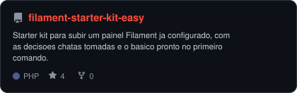
</picture>
</a>
</td>
<td align="center">
<a href="https://github.com/gsferro/filament-stat-plus-easy">
<picture>
  <source media="(prefers-color-scheme: dark)"  srcset="assets/card-filament-stat-plus-easy-dark.svg">
  <source media="(prefers-color-scheme: light)" srcset="assets/card-filament-stat-plus-easy-light.svg">
  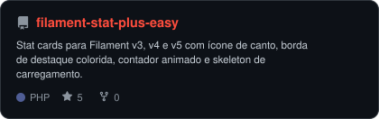
</picture>
</a>
</td>
</tr>
<tr>
<td align="center">
<a href="https://github.com/gsferro/filament-odometer-easy">
<picture>
  <source media="(prefers-color-scheme: dark)"  srcset="assets/card-filament-odometer-easy-dark.svg">
  <source media="(prefers-color-scheme: light)" srcset="assets/card-filament-odometer-easy-light.svg">
  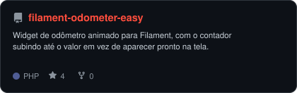
</picture>
</a>
</td>
<td align="center">
<a href="https://github.com/gsferro/laravel-powermodel">
<picture>
  <source media="(prefers-color-scheme: dark)"  srcset="assets/card-laravel-powermodel-dark.svg">
  <source media="(prefers-color-scheme: light)" srcset="assets/card-laravel-powermodel-light.svg">
  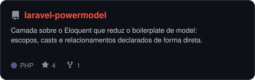
</picture>
</a>
</td>
</tr>
<tr>
<td align="center">
<a href="https://github.com/gsferro/laravel-filtereasy">
<picture>
  <source media="(prefers-color-scheme: dark)"  srcset="assets/card-laravel-filtereasy-dark.svg">
  <source media="(prefers-color-scheme: light)" srcset="assets/card-laravel-filtereasy-light.svg">
  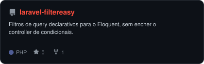
</picture>
</a>
</td>
<td align="center">
<a href="https://github.com/gsferro/laravel-translation-solution-easy">
<picture>
  <source media="(prefers-color-scheme: dark)"  srcset="assets/card-laravel-translation-solution-easy-dark.svg">
  <source media="(prefers-color-scheme: light)" srcset="assets/card-laravel-translation-solution-easy-light.svg">
  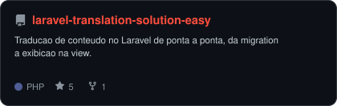
</picture>
</a>
</td>
</tr>
</table>

<a href="https://packagist.org/packages/gsferro/">ver todos os pacotes no Packagist →</a>

---

<picture>
  <source media="(prefers-color-scheme: dark)"  srcset="https://raw.githubusercontent.com/gsferro/gsferro/output/github-contribution-grid-snake-dark.svg">
  <source media="(prefers-color-scheme: light)" srcset="https://raw.githubusercontent.com/gsferro/gsferro/output/github-contribution-grid-snake.svg">
  
</picture>

  

` Feito com café e composer require · @gsferro `

